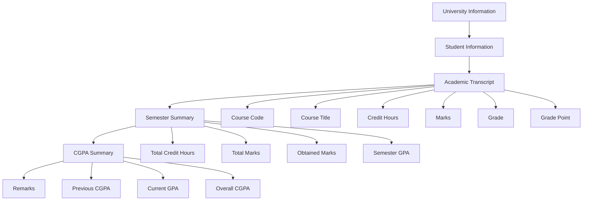

# Assignment 01 — Personal Academic Transcript

## Objective

The objective of this assignment is to create a university-style academic transcript using HTML only.

This assignment will provide practice with:

```
HTML tables

Table rows and columns

Table headings and data cells

colspan

rowspan

Table sections

Student information

Academic records

Lists

```

## Assignment Requirements

Create a file named:

```transcript.html```


The transcript should contain the following information.

## 1. University Information

### Include:

 - University name

 - Department name

 - Faculty/School name

 - Academic session

## 2. Student Information

### Include:

- Student name

- Father name

- Registration number

- Roll number

- Program/degree

- Semester

- Academic year

## 3. Academic Transcript

Create a table containing:

Field	Description
Course Code	Course identification code
Course Title	Name of the course
Credit Hours	Number of credit hours
Total Marks	Maximum marks
Obtained Marks	Student's obtained marks
Grade	Letter grade
Grade Point	Grade point
Status	Pass/Fail

## 4. Semester Summary

### Include:

- Total Credit Hours

- Total Marks
- Obtained Marks

- Semester GPA

- Overall CGPA

## 5. Important HTML Concepts

The transcript should demonstrate the following HTML concepts:

```html
<table>

<caption>

<thead>

<tbody>

<tfoot>

<tr>

<th>

<td>

```
```colspan```

```rowspan```

### HTML Only

This assignment must be created using HTML only.

Allowed

 - HTML elements

 - HTML attributes

 - HTML tables

 - HTML lists

 - HTML headings

 - HTML paragraphs

 - HTML links

## Not Required

 - CSS

 - JavaScript

 - Bootstrap

 - Tailwind CSS

 - External libraries

The purpose of this assignment is to practice HTML structure and table concepts.

Suggested Transcript Structure
University Information
        ↓
Student Information
        ↓
Academic Transcript
        ↓
Semester Summary
        ↓
CGPA Summary
        ↓
Remarks


Agar aap **thoda zyada detailed Mermaid flowchart** chahte hain:


## Suggested Transcript Structure



## Suggested Table Structure

A possible transcript table can look like this:

| Course Code | Course Title          | Credit Hours | Total Marks | Obtained Marks | Grade | Grade Point | Status |
|-------------|-----------------------|--------------|-------------|----------------|-------|-------------|--------|
| CS-501      | Web Development       | 3            | 100         | 85             | A     | 4.00        | Pass   |
| CS-502      | Database Systems      | 3            | 100         | 78             | B+    | 3.50        | Pass   |
| CS-503      | Computer Networks     | 3            | 100         | 82             | A-    | 3.75        | Pass   |
| CS-504      | Software Engineering  | 3            | 100         | 75             | B     | 3.00        | Pass   |

<br>

The above data is only an example. Replace it with your own academic information.

HTML Concepts to Practice
## Table Header

```Use <th> for headings: ```

```html
<tr>
    <th>Course Code</th>
    <th>Course Title</th>
    <th>Credit Hours</th>
</tr>

```
## Table Data

```Use <td> for data:```
```html
<tr>
    <td>CS-501</td>
    <td>Web Development</td>
    <td>3</td>
</tr>
```

## Colspan

```Use colspan when one cell needs to cover multiple columns:```

```html
<tr>
    <th colspan="8">Academic Transcript</th>
</tr>
```

## Rowspan

```Use rowspan when one cell needs to cover multiple rows:```

```html
<tr>
    <th rowspan="2">Semester</th>
    <td>5th Semester</td>
</tr>

<tr>
    <td>2026</td>
</tr>

```
# File Structure

The assignment should follow this structure:

```
Assignments/
└── assignment-01/
    ├── README.md
    └── transcript.html

```
# Learning Outcomes

```
 --> After completing this assignment, I should be able to:

 --> Create a complete HTML document.

 --> Create structured HTML tables.

 --> Use table headings and data cells correctly.

 --> Organize academic information in tabular form.

 --> Use rowspan and colspan.

 --> Use <thead>, <tbody> and <tfoot>.

 --> Create a structured university-style transcript.

 --> Build a complete HTML page without using CSS or JavaScript.

```

# Submission Checklist

  - transcript.html is created.

  - University information is included.

  - Student information is included.

  - Course information is included.

  - Credit hours are included.

  - Marks are included.

  - Grades are included.

  - GPA/CGPA is included.

 
 ```<table> is used correctly.```


``` <th> and <td> are used.```

 ```
 colspan is practiced.

 rowspan is practiced.
```


``` <thead>, <tbody> and <tfoot> are used.```

 No CSS is used.

 No JavaScript is used.

# Assignment Status

Status: In Progress

Topic: HTML Lists & HTML Tables

Assignment: Personal Academic Transcript

Technology: HTML only